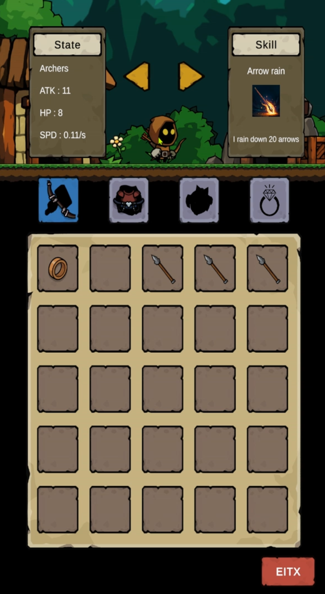
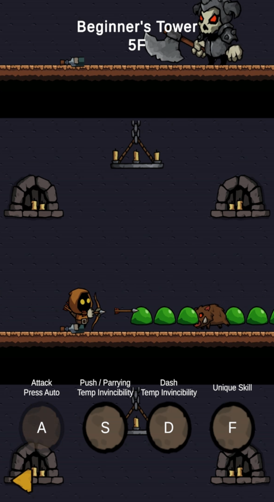

## 📑 목차
- [📋 개요](#-개요)
- [🎬 인게임 사진](#-인게임-사진)
- [🔗 관련 링크](#-관련-링크)
- [✨ 주요 기능](#-주요-기능)
- [🎯 핵심 구현](#-핵심-구현)
- [📂 프로젝트 구조](#-프로젝트-구조)
- [🛠 기술 스택](#-기술-스택)
- [🏗 아키텍처](#-아키텍처)


## 📋 개요
<table>
  <tr>
    <td>
      <table>
        <tr><td>기간</td><td>2026.03.13 ~ 2026.03.15 (3일)</td></tr>
        <tr><td>인원</td><td>1명 (클라이언트)</td></tr>
        <tr><td>역할</td><td>클라이언트 개발</td></tr>
        <tr><td>도구</td><td>Unity, C#</td></tr>
        <tr><td>타겟 기기</td><td>PC</td></tr>
        <tr><td>레퍼런스</td><td>Tower Breaker</td></tr>
      </table>
  </tr>
</table>

Tower Breaker의 코어 게임 루프를 Unity로 클로닝한 프로젝트입니다.

**전투 → 층 클리어 → 보상(장비 획득) → 아웃게임 장착 → 전투** 의 사이클을 중심으로, 3일이라는 제한된 시간 안에 최대한 많은 기능을 구현하는 것을 목적으로 했습니다.

빠르게 개발을 진행하다 보니 아쉽고 놓친 부분들이 남아있지만, 개발은 마무리되었습니다.


## 🎬 인게임 사진

<table>
  <tr>
    <td align="center">
      
      <br/>
      <b>아웃게임 — 장비 화면</b>
    </td>
    <td align="center">
      
      <br/>
      <b>인게임 — 전투 화면</b>
    </td>
  </tr>
</table>


## 🔗 관련 링크
<table>
  <tr><td>플레이 영상</td><td><a href="https://www.youtube.com/watch?v=rklSUsvcjxw">바로가기</a></td></tr>
</table>


## ✨ 주요 기능

### 플레이어 조작
- **A 키** : 공격 — 홀드 시 연속 공격, 애니메이션 이벤트(OnMeleeHit / OnArrowSpawn)로 타격 판정 타이밍 제어
- **S 키** : 패링 / 밀어내기(경계 반격) — 보스 창 제거 및 Stagger 경직 부여, 무적 0.25초 적용
- **D 키** : 대쉬 — 가장 가까운 적 앞으로 순간이동, 대쉬 클립 지속시간 동안 무적 프레임
- **F 키** : 캐릭터 고유 스킬 — 장착한 캐릭터 타입에 따라 분기 실행

### 캐릭터 3종 및 스킬
- **검병** : 전방 OverlapBox 범위에 ATK×2 슬래시 공격
- **궁수** : X 범위 내 20발의 화살 순차 낙하 (오브젝트 풀 사용)
- **창병** : ATK 50% 복제 클론 소환 — 플레이어 공격 시 동시 타격

### 장비 시스템
- **획득** : 층 클리어 시 TreasureBox 오픈, FloorSpawnConfig의 possibleRewards 풀에서 랜덤 지급
- **저장** : PlayerPrefs 기반 씬 간 영구 저장 / 로드 (25슬롯 고정)
- **UI** : DraggableUI로 인벤토리 ↔ 장착 슬롯 드래그앤드롭 스왑, 무기 타입 불일치 시 자동 거부

### 적 / 보스
- **일반 적 3종** : EnemyData ScriptableObject로 스탯 정의, Fisher-Yates 셔플 배치
- **Boss 1** : State 패턴 AI — Charge 돌진 패턴
- **Boss 2** : State 패턴 AI — SpearThrow 투사체 (Dynamic Rigidbody2D + 중력)
- **패링 성공 시** 보스 Stagger 경직 적용

### 추가 구현
- 히트 프리즈 — 스킬 발동 시 timeScale = 0 연출
- 패링 보스 Stagger
- 대쉬 무적 프레임
- 아이템 툴팁 UI — 마우스 호버 시 스탯 표시


## 🎯 핵심 구현

### 1️⃣ 9-State FSM으로 전투 흐름과 timeScale 중앙 관리

#### 📌 해결하고자 한 문제
전투 입력, 적 이동, 스킬 연출, 대쉬, 경계 밀림 등 여러 시스템이 각자 `Time.timeScale`을 조작하거나 상태를 직접 체크하면 제어 흐름이 파편화됩니다. 이를 단일 지점에서 관리해 상태 충돌과 중복 코드를 없애고자 했습니다.

#### 🔧 구현 방법
`GameState` 열거형 9개로 모든 전투 단계를 정의하고, `GameManager.SetState()` 한 곳에서 `timeScale` 전환과 이벤트 발행을 처리합니다. 구독자(PlayerAnimator, PlayerCombat 등)는 `OnStateChanged` 이벤트만 바라보면 되므로 GameManager에 대한 직접 참조가 최소화됩니다.

#### 🎯 핵심 구현 내용

**① GameState 열거형 — 9개 상태 정의 (GameManager.cs:8-19)**
```csharp
public enum GameState
{
    Entering,      // 플레이어 등장 이동 중
    Combat,        // 적 이동 + 플레이어 입력 활성
    Reward,        // 보상 방 진행 중
    Cleared,       // 적 전멸, 플레이어 퇴장 이동
    Transitioning, // 층 전환 중 (카메라 스크롤)
    Skill,         // 스킬 연출 중 — timeScale=0으로 전체 freeze
    Dash,          // 대쉬 중 — 다른 입력 차단
    Pinned,        // 플레이어가 왼쪽 경계에 밀림 — timeScale=0
    GameOver,      // 게임 오버 — timeScale=0
}
```

**② SetState() — timeScale 중앙 제어 + 이벤트 발행 (GameManager.cs:52-66)**
```csharp
public void SetState(GameState state)
{
    CurrentState = state;

    // timeScale 중앙 관리 — Pinned/Skill/GameOver는 0, 나머지는 1
    Time.timeScale = state switch
    {
        GameState.Pinned   => 0f,
        GameState.Skill    => 0f,
        GameState.GameOver => 0f,
        _                  => 1f,
    };

    OnStateChanged?.Invoke(state);
}
```
- **단일 진입점** : `Time.timeScale` 변경을 `SetState()` 에서만 수행해 실수로 외부에서 값이 바뀌는 경우를 원천 차단
- **이벤트 발행** : `OnStateChanged`를 구독한 컴포넌트들이 각자 필요한 처리를 수행하므로 GameManager가 구독자를 직접 참조하지 않음

#### ✨ 달성 효과
새로운 상태가 추가되어도 `GameState` 열거형과 `switch` 분기 1개만 수정하면 되어 확장 비용이 낮습니다. 기존 구독자 코드는 변경 없이 그대로 동작합니다.

---

### 2️⃣ Object Pooling + 사전 배치 패턴으로 스폰 부하 분산

#### 📌 해결하고자 한 문제
층 전환 시 적을 한꺼번에 Instantiate하면 순간적인 부하 스파이크가 발생합니다. 동시에 매 층마다 동일 타입의 적을 Destroy/Instantiate하는 것은 GC 비용을 늘립니다.

#### 🔧 구현 방법
두 가지 전략을 결합했습니다. 첫째, `EnemyData`별로 `ObjectPool<Enemy>`를 생성해 적 오브젝트를 재사용합니다. 둘째, `PreloadFloor() → ActivateFloor() → UnloadFloor()` 3단계 분리로 스폰 비용을 층 전환 이전 시점으로 분산합니다. 스폰 배치는 Fisher-Yates 셔플로 편중 없이 배열합니다.

#### 🎯 핵심 구현 내용

**① EnemyData별 ObjectPool 생성 (EnemySpawnManager.cs:269-282)**
```csharp
private ObjectPool<Enemy> GetOrCreatePool(EnemyData data)
{
    if (!_pools.ContainsKey(data))
    {
        _pools[data] = new ObjectPool<Enemy>(
            createFunc:      ()    => Instantiate(_enemyPrefab),
            actionOnGet:     enemy => enemy.gameObject.SetActive(true),
            actionOnRelease: enemy => enemy.gameObject.SetActive(false),
            actionOnDestroy: enemy => Destroy(enemy.gameObject)
        );
    }
    return _pools[data];
}
```

**② 3단계 사전 배치 패턴 (EnemySpawnManager.cs:71-136)**
```csharp
// 층 진입 전 — 풀에서 꺼내 대기 위치에 배치
public void PreloadFloor(int floor, Vector2 origin)
{
    List<EnemyData> shuffled = BuildShuffledList(floor);
    // ...풀에서 Get → Initialize → pendingEnemies 등록
}

// 층 진입 시 — 대기 적을 전투 목록으로 편입
public void ActivateFloor(int floor)
{
    foreach (Enemy enemy in enemies)
    {
        enemy.OnDied += OnEnemyDied;
        _livingEnemies.Add(enemy);
        _currentFloorEnemies.Add(enemy);
    }
}

// 층 이탈 후 — 미사용 층 적을 풀에 반환
public void UnloadFloor(int floor)
{
    foreach (Enemy enemy in enemies)
        _pools[enemy.Data].Release(enemy);
}
```

**③ Fisher-Yates 셔플 O(n) (EnemySpawnManager.cs:292-330)**
```csharp
// percent 기반으로 배분 후 Fisher-Yates 셔플한 리스트 반환
private List<EnemyData> BuildShuffledList(int floor)
{
    // ...percent 기반 마릿수 분배...

    // Fisher-Yates shuffle
    for (int i = list.Count - 1; i > 0; i--)
    {
        int j = UnityEngine.Random.Range(0, i + 1);
        (list[i], list[j]) = (list[j], list[i]);
    }
    return list;
}
```
- **편중 없는 배치** : 동일 타입 적이 앞에만 몰리는 현상 없이 O(n)으로 균등 배열
- **HashSet 넉백** : `_currentFloorEnemies`(HashSet)로 현재 층 적만 추적해 타 층 적이 의도치 않게 넉백되는 것을 방지

#### ✨ 달성 효과
층 전환 시 Instantiate 호출이 0으로, 적 사망 시 Destroy 호출이 0으로 줄어 GC 스파이크 없이 부드러운 층 전환이 가능해졌습니다.


## 📂 프로젝트 구조

```
Assets/Scripts/
├── 📁 Core/
│   ├── GameManager.cs              # 9-State FSM, timeScale 중앙 제어
│   ├── SceneController.cs          # 씬 전환
│   ├── CameraScrollController.cs
│   └── ResolutionManager.cs
│
├── 📁 Player/
│   ├── PlayerCombat.cs             # 공격 · 대쉬 · 패링 입력
│   ├── PlayerMover.cs              # 물리 이동
│   ├── PlayerHealth.cs             # 체력 · 무적 · 사망
│   ├── PlayerSkillHandler.cs       # F키 스킬 3종 분기
│   ├── PlayerStats.cs              # 장비 스탯 집계
│   ├── PlayerAnimator.cs           # Animator 래퍼
│   ├── PlayerBoundaryHandler.cs    # 경계 반격
│   ├── PlayerClone.cs              # 창병 Clone 소환체
│   └── Data/
│
├── 📁 Enemy/
│   ├── Enemy.cs
│   ├── EnemySpawnManager.cs        # 2-tier 풀 + Fisher-Yates 셔플
│   └── Data/
│
├── 📁 Boss/
│   ├── Boss.cs
│   ├── BossAI.cs                   # State 패턴 AI (Chase/Attack/Skill)
│   ├── BossManager.cs
│   ├── IBossIntroSequence.cs
│   └── Data/
│
├── 📁 Floor/
│   ├── FloorManager.cs             # 층 오케스트레이터
│   ├── GridPool.cs
│   └── Grid/
│
├── 📁 Inventory/
│   ├── PlayerInventory.cs          # 25슬롯, PlayerPrefs 저장
│   ├── ItemData.cs
│   ├── ItemDatabase.cs
│   └── ItemType.cs
│
├── 📁 Pool/
│   └── ObjectPoolManager.cs        # ID 기반 범용 오브젝트 풀
│
├── 📁 Projectile/
│   ├── Arrow.cs
│   └── BossSpear.cs
│
└── 📁 UI/
    ├── InGame/
    └── OutGame/
```


## 🛠 기술 스택

### 클라이언트
- **Unity 6000.3.10f1 LTS** - 게임 엔진
- **C#** - 프로그래밍 언어
- **JetBrains Rider 25.2.1** - 통합 개발 환경

### 렌더링
- **2D URP (Universal Render Pipeline)** - 렌더 파이프라인

### 데이터 관리
- **ScriptableObject** - 캐릭터 · 적 · 보스 · 아이템 데이터 정의
- **PlayerPrefs** - 인벤토리 영구 저장

### 디자인 패턴
- **FSM (Finite State Machine)** - 전투 흐름 중앙 관리
- **Object Pooling** - 적 · 투사체 재사용
- **Event-Driven** - 컴포넌트 간 단방향 결합
- **SRP Component** - 플레이어 기능 분리


## 🏗 아키텍처

### 시스템 구성

```
┌─────────────────────────────────────────────────────────┐
│                     GameManager                         │
│               9-State FSM + timeScale 관리               │
│         OnStateChanged 이벤트로 하위 시스템에 전파         │
└──────────────┬──────────────────────────┬───────────────┘
               ▼                          ▼
┌──────────────────────────┐  ┌───────────────────────────┐
│        Player            │  │      EnemySpawnManager    │
│  ┌────────────────────┐  │  │  ObjectPool<Enemy> ×3     │
│  │ PlayerCombat       │  │  │  PreloadFloor             │
│  │ PlayerMover        │  │  │  ActivateFloor            │
│  │ PlayerHealth       │  │  │  UnloadFloor              │
│  │ PlayerSkillHandler │  │  │  Fisher-Yates 셔플         │
│  │ PlayerStats        │  │  └───────────────────────────┘
│  │ PlayerAnimator     │  │                ▼
│  │ PlayerBoundaryHandler│ │  ┌───────────────────────────┐
│  └────────────────────┘  │  │       FloorManager        │
└──────────────────────────┘  │  층 오케스트레이터            │
               ▲              └───────────────────────────┘
               │
┌──────────────────────────┐
│    PlayerInventory       │
│  OnCharacterChanged 이벤트│
│  → Stats / Combat /      │
│    SkillHandler / Animator│
└──────────────────────────┘
```

### 핵심 워크플로우

#### 1️⃣ 전투 루프
```
GameManager.SetState(Entering)
    ↓
FloorManager가 PreloadFloor(현재층+1) 예약
    ↓
EnemySpawnManager.ActivateFloor(현재층)
    ↓
GameManager.SetState(Combat) — 입력 + 적 이동 활성
    ↓
플레이어 A/S/D/F 입력 처리
    ↓
Enemy.OnDied → EnemySpawnManager.OnAllDefeated
    ↓
GameManager.SetState(Cleared)
```

#### 2️⃣ 장비 흐름
```
TreasureBox 오픈 (층 클리어 보상)
    ↓
PlayerInventory에 ItemData 추가 (25슬롯)
    ↓
OutGame — DraggableUI 드래그앤드롭 장착
    ↓
PlayerInventory.OnCharacterChanged 이벤트 발행
    ↓
PlayerStats 스탯 재집계
PlayerCombat / PlayerSkillHandler 캐릭터 교체
```

#### 3️⃣ 이벤트 흐름
```
GameManager.OnStateChanged
    → PlayerAnimator (애니메이션 상태 전환)
    → PlayerCombat (입력 차단 여부)

EnemySpawnManager.OnAllDefeated
    → FloorManager (다음 층 전환 시작)

PlayerInventory.OnCharacterChanged
    → PlayerStats / PlayerCombat / PlayerSkillHandler / PlayerAnimator
```
